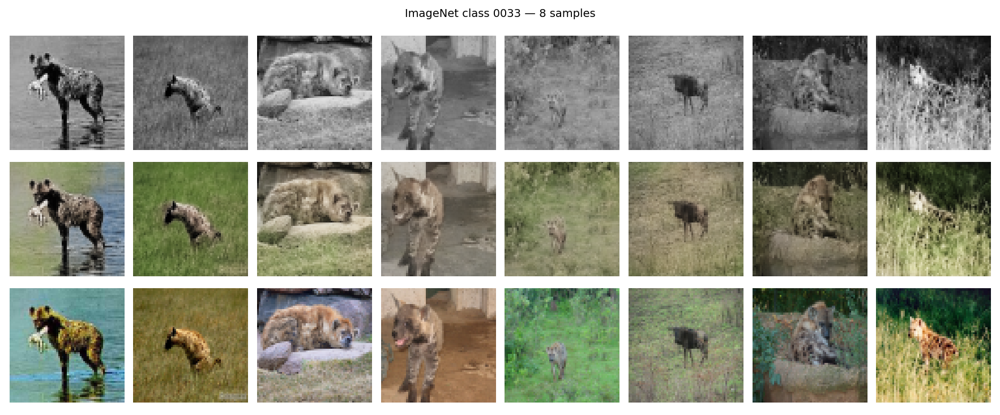

# 🎨 Old Pictures Colorization — Deep Learning with U-Net

This project implements a *deep learning pipeline* to colorize grayscale images using a *U-Net model* trained on the *Downsampled ImageNet-64 dataset*.  
It converts the dataset into folders of PNGs, trains a U-Net for RGB color prediction, evaluates performance using *L1* and *SSIM, and supports **fine-tuning* and *visualization* on custom real-world images.

---

## 📁 Project Structure

```bash
old_pics_colorization/
│
├── data/
│   ├── imagenet64/              # Raw ImageNet-64 pickle/npz batches
│   ├── converted64/             # Converted PNG dataset (train/val/test)
│   └── online_test_images/      # Custom real-world images for inference
│
├── scripts/
│   ├── images64_split.py        # Convert ImageNet64 pickle batches → PNG folders
│   ├── train64.py               # Train U-Net model from scratch
│   ├── resume_train64.py        # Fine-tune existing model (mixed L1 + SSIM)
│   ├── Unet64_preds.py          # Visualize predictions on test or custom images
│   ├── evall.py                 # Evaluate trained models (L1 + SSIM metrics)
│   └── overtune_curves.py       # Plot learning curves & detect overfitting
│
├── results/
│   ├── checkpoints/             # Saved models 
│   ├── plots/                   # Optional metrics/curve visualizations
│   ├── predictions/             # Example outputs (gray vs predicted vs color) 
│   └── chosen classes/          # Saves labels of chosen classes when working with subsets 
│  
│
└── README.md


```
# ⚙️ Installation
```
git clone https://github.com/hosnei/old_pics_colorization.git

cd old_pics_colorization
```
## (optional) create environment
```
python3 -m venv colorenv

source colorenv/bin/activate
```

## install dependencies
```
pip install -r requirements.txt
```

---

## 🧠 Model Overview

The model is a U-Net with skip connections between encoder and decoder stages:

Encoder: three downsampling blocks (Conv → ReLU → Pool)

Bottleneck: deepest feature extraction layer (512 channels)

Decoder: upsampling via transposed convolutions + concatenation with encoder features

Output: 3-channel RGB prediction (via tanh, scaled to [–1, 1])

Input format: (1, 64, 64) grayscale

Output format: (3, 64, 64) RGB colorized image


# 🏋️‍♂️ Training

Convert the dataset (one-time operation):
```
python3 scripts/images64_split.py
```

Train the base model:
```
python3 scripts/train64.py
```

You can specify:

- number of epochs (epochs=10)

- learning rate (lr=1e-4)

- number of classes to train on (num_classes=100)

Example:
```
train_model(epochs=5, lr=1e-4, num_classes=100)
```

Fine-tune an existing model:
```
python3 scripts/resume_train64.py
```

# 📊 Evaluation

Evaluate L1 and SSIM metrics for any saved checkpoint:
```
python3 scripts/evall.py
```

Example output:

Model:  Models/unet_colorizer_1K.pt

Validation L1: 0.0920

Validation SSIM: 0.7900


You can also plot training vs validation curves with scripts/overtune_curves.py
to check for overfitting (high training accuracy but lower validation performance).

# 🎨 Inference (Colorization)

Use the pretrained model to colorize new images:
```
python3 scripts/Unet64_preds.py
```

Then choose:

1️⃣  Test set (by class ID)

2️⃣  Custom folder (real-world images → auto-grayscaled)


All colorized results will be displayed in a 3-row grid:

| Grayscale Input | Model Prediction | Original Color |

# 🧩 Fine-Tuning Details

- Loss: 0.5 * L1 + 0.5 * (1 - SSIM)

- Optimizer: AdamW (lr=1e-4, weight_decay=5e-5)

- Scheduler: CosineAnnealingLR

# Optional improvements:

- Replace BatchNorm with InstanceNorm2d

- Add light dropout (p=0.05–0.1) in decoder blocks

- Post-process outputs in HSV space to boost saturation & contrast

# 🖼️ Example Results
Here are some sample outputs from the U-Net colorization model:

<p align="center">
  
</p>
	
	
# 🧰 Notes

Default image size: 64×64

You can train on subsets (e.g., 10 or 100 ImageNet classes)

Models are saved in /results/checkpoints and automatically reloaded for fine-tuning

Supports GPU (cuda) or CPU fallback

# 🧑‍💻 Author

Housni TIBA
Télécom Physique Strasbourg — Master ID

Deep Learning & Vision Projects | U-Net, CNN, Colorization, Optical AI

📧 LinkedIn Profile : Housni Tiba

📦 GitHub: hosnei
